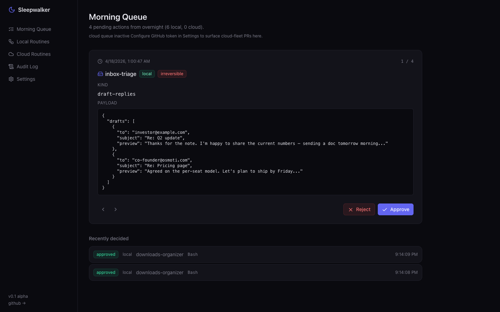
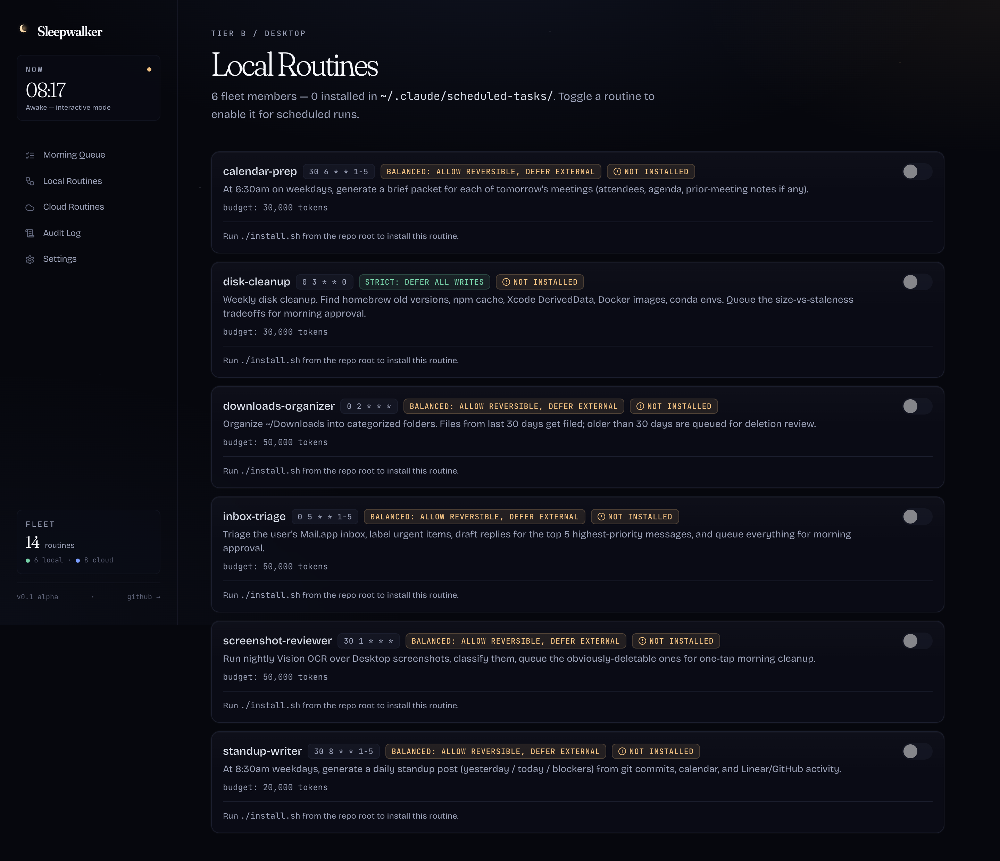
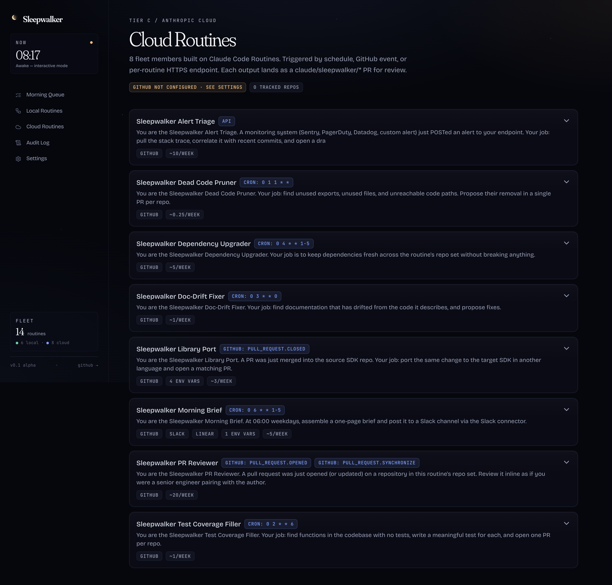
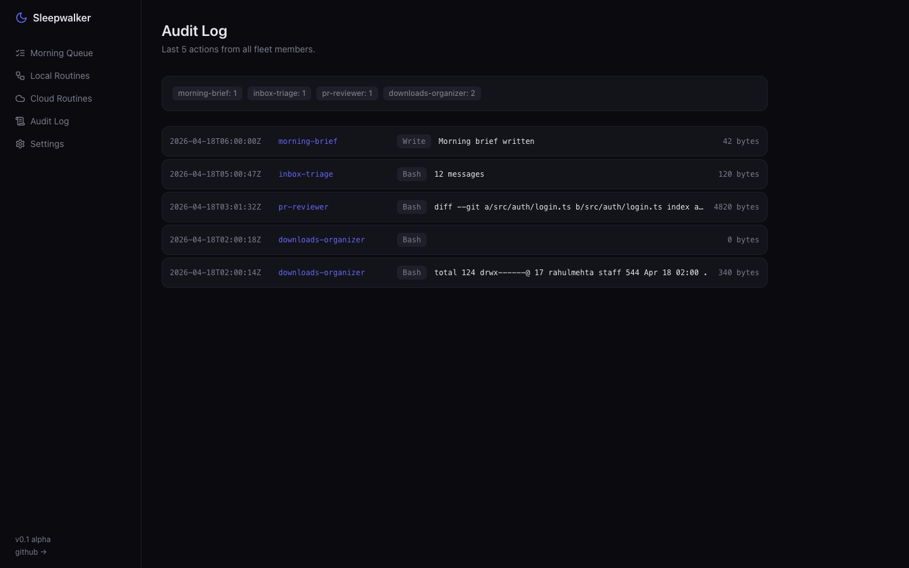
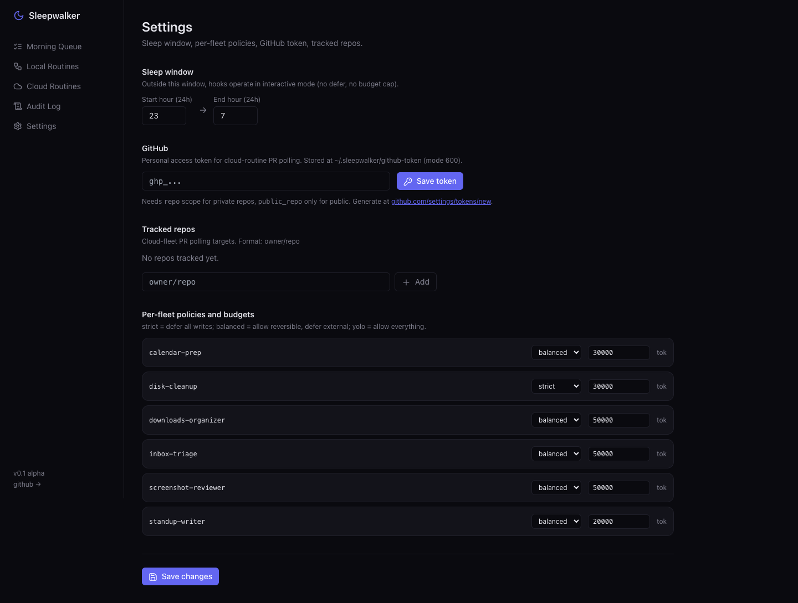

# Sleepwalker

> **The Mac that runs while you sleep — and the cloud that picks up where it can't reach.**

A curated fleet of Claude Code agents that handle your overnight busywork — inbox triage, PR reviews, dependency upgrades, file organization, doc-drift fixes — and present a single swipe-through Morning Queue at wake.



Sleepwalker is the first overnight-agent product built on **both** of Anthropic's autonomous-execution surfaces:

- **Local fleet** runs on your Mac via [Claude Code Desktop Scheduled Tasks](https://code.claude.com/docs/en/desktop-scheduled-tasks). It can touch Mail.app, Calendar, Photos, your Downloads, your local repos.
- **Cloud fleet** runs on [Claude Code Routines](https://code.claude.com/docs/en/routines). It opens PRs from `claude/`-prefixed branches, listens for GitHub events, and exposes per-routine HTTPS endpoints you can fire from the dashboard's "Run now" button, Sentry/PagerDuty webhooks, deploy pipelines, or an iOS Shortcut.

The dashboard at `localhost:4001` unifies both into one surface: one queue, one audit log, one place to approve.

```
┌──────────────────────────────────────────────────────────────────┐
│                        Sleepwalker — overnight                   │
├─────────────────────────┬────────────────────────────────────────┤
│  Local fleet (Mac)      │  Cloud fleet (Routines)                │
├─────────────────────────┼────────────────────────────────────────┤
│  02:00  Downloads filed │  on PR opened: review drafted          │
│  03:00  Receipts sorted │  weekdays 04:00: deps upgraded         │
│  05:00  Inbox triaged   │  on prod alert: triage PR opened       │
│  06:00  Brief assembled │  weekly: docs drift swept              │
└─────────────────────────┴────────────────────────────────────────┘
                               │
                               ▼
┌──────────────────────────────────────────────────────────────────┐
│              Morning Queue (07:00, localhost:4001)               │
│                                                                  │
│   ┌─ 8 actions awaiting review (4 local, 4 cloud) ─────────┐    │
│   │ [▶ swipe to review]                                     │    │
│   └─────────────────────────────────────────────────────────┘    │
└──────────────────────────────────────────────────────────────────┘
```

## Why this exists

Every overnight-AI-agent product (Devin, Cursor BG agents, Replit Agent, Lindy, OpenAI Operator) has the same three complaints:

1. **Surprise cost bills** — runaway loops, no per-task budget caps.
2. **False "done" claims** — claims success when failed.
3. **No good answer to "what did it do?"** — scattered notifications, no audit trail.

Sleepwalker fixes all three by being native to Claude Code's own primitives:

| Problem | Local fleet (Tier B) | Cloud fleet (Tier C / Routines) |
|---------|---------------------|--------------------------------|
| Surprise bills | `PostToolUse` hook caps tokens per fleet member | Per-routine subscription + daily run cap, visible at claude.ai/code/routines |
| False "done" | `defer` decision parks every irreversible action; you approve at wake | Output is always a `claude/sleepwalker/*` branch — review the PR, merge or close |
| No audit | Single Morning Queue UI with timestamped log + reversibility colors | GitHub PR list = audit trail, polled into the same Morning Queue |

## How it works

**Each local fleet member is a Tier-B Desktop Scheduled Task** at `~/.claude/scheduled-tasks/sleepwalker-<name>/SKILL.md` with its own permission scope and "Always allowed" allowlist.

**Each cloud fleet member is a Tier-C Routine** at claude.ai/code/routines with its own prompt, repo set, connectors, and triggers (schedule / API / GitHub event).

**Three local hooks enforce safety on the Mac:**
- `sleepwalker-defer-irreversible.sh` (PreToolUse) parks `WebFetch`, `Bash(git push)`, `Bash(curl POST)`, `Bash(gh pr create)` etc. into the Morning Queue
- `sleepwalker-budget-cap.sh` (PostToolUse) counts tokens, halts at the per-fleet limit
- `sleepwalker-audit-log.sh` (PostToolUse) appends every action to `~/.sleepwalker/audit.jsonl`

**One queue across both tiers:**
- Local routines write to `~/.sleepwalker/queue.jsonl` directly via the defer hook
- Cloud routines push `claude/sleepwalker/*` branches to your repos; the dashboard polls GitHub for them
- The Morning Queue UI shows both, swipe-through

## The fleet (15 routines)

### Local (6 — runs on your Mac)

These need direct access to local apps. Run via Desktop Scheduled Tasks.

| Routine | Schedule | What it does |
|---------|----------|--------------|
| `sleepwalker-inbox-triage` | weekdays 5:00 | Mail.app: classify, draft top 5 replies (queued, not sent) |
| `sleepwalker-downloads-organizer` | daily 2:00 | File `~/Downloads` by type; queue 30+ day stale for deletion review |
| `sleepwalker-calendar-prep` | weekdays 6:30 | Brief packets for tomorrow's meetings |
| `sleepwalker-standup-writer` | weekdays 8:30 | Daily standup from local git + calendar |
| `sleepwalker-screenshot-reviewer` | daily 1:30 | Vision OCR + classify Desktop screenshots |
| `sleepwalker-disk-cleanup` | weekly Sun 3:00 | Find homebrew old versions, npm cache, Xcode DerivedData |

### Cloud (8 — runs on Anthropic infra via Routines)

These operate on GitHub repos, can use MCP connectors, run while your laptop is closed.

| Routine | Trigger | What it does |
|---------|---------|--------------|
| `pr-reviewer` | GitHub `pull_request.opened` | Inline review with security/perf/style checks, summary comment |
| `dependency-upgrader` | weekdays 04:00 | Bump npm/pip/cargo deps, run tests on `claude/sleepwalker/deps` branch |
| `doc-drift-fixer` | weekly Sun 03:00 | Find drifted READMEs/docstrings, open PR per repo |
| `test-coverage-filler` | weekly Sat 02:00 | Find uncovered functions, write tests, open PR |
| `dead-code-pruner` | monthly | Find unused exports, propose removal |
| `morning-brief` | weekdays 06:00 | Pull from Slack/Linear connectors, post digest to a channel |
| `library-port` | GitHub `pull_request.closed` (merged) on SDK A | Port to SDK B in another language, open matching PR |
| `alert-triage` | API trigger from Sentry/PagerDuty | Pull stack trace, correlate with recent commits, draft fix PR |

All routines are **disabled by default**. Enable from the dashboard.

## Quickstart

```bash
git clone https://github.com/rahulmehta25/sleepwalker.git
cd sleepwalker
./install.sh                                        # local fleet + hooks
cd dashboard && pnpm install && pnpm dev             # dashboard on localhost:3000
```

For the **local fleet**: open the dashboard → Routines → toggle to enable.
For the **cloud fleet**: open the **Cloud Routines** page → click "Set up" on each → it generates the `/schedule create` command + opens claude.ai/code/routines pre-filled.

[Full quickstart guide →](docs/QUICKSTART.md) · [Authoring guide (v0.2, 4 runtimes) →](docs/AUTHORING.md) · [Routine catalog →](docs/ROUTINES.md) · [Architecture →](docs/ARCHITECTURE.md)

## How to Use

### Core Workflow

**1. Author a routine** → Go to `/editor`
- Name it, write a prompt, pick a runtime (Codex / Gemini / Claude Desktop / Claude Routines), set a cron schedule
- Set reversibility: **green** = read-only, **yellow** = local writes, **red** = external effects (deferred for approval overnight)
- Set a character budget cap → Click **Save routine**

**2. Deploy it** → Go to `/routines`
- Find your routine → Click **Deploy**
- This creates a launchd plist (Codex/Gemini) or hands off to Claude Desktop/Routines
- The routine now runs on schedule automatically

**3. Review in the morning** → Go to `/` (Morning Queue)
- Any dangerous actions the agent tried were **deferred** overnight
- You see each deferred action with its tool, arguments, and reversibility classification
- **Approve** or **Reject** each one — approved actions get re-executed

**4. Audit trail** → Go to `/audit`
- Every tool call from every overnight run is logged
- Budget overruns, deferrals, and completions all appear here

### The Safety Model

```
Agent runs overnight
    ├─ Read-only actions (ls, cat, grep)     → ✅ Allowed immediately
    ├─ Reversible writes (edit, mkdir, mv)   → ✅ Allowed under "balanced" policy
    ├─ Irreversible actions (rm, git push,   → ⏸️ Deferred to Morning Queue
    │   curl POST, npm publish)              
    └─ Budget exceeded                       → 🛑 SIGTERM + audit entry
```

Everything flows through three bash hooks that wire into Claude Code's hook system — no agent modifications needed. The hooks work with any Claude Code session that has a `[sleepwalker:fleet/slug]` marker in its prompt.

## Power User Tips

| Task | How |
|------|-----|
| **Run a routine immediately** | `/routines` → click **Run now** on any deployed routine |
| **Tune safety per-fleet** | `/settings` → change policy to `strict` (defer all writes), `balanced` (defer red only), or `yolo` |
| **Set overnight hours** | `/settings` → Sleep Window start/end hours — hooks only defer during this window |
| **Connect cloud routines** | `/settings` → paste a GitHub PAT → add `owner/repo` → Claude Routines PRs appear in Morning Queue |
| **Save routine to git** | `/routines` → **Save to repo** → review diff → commit message → creates a local git commit |
| **Check runtime health** | Health badges auto-appear on Morning Queue and Editor — shows which CLIs are installed and ready |
| **Author + deploy in one flow** | `/editor` → fill all fields → Save → `/routines` → Deploy — done in under a minute |
| **Adjust budget per routine** | `/settings` → Per-fleet Policies → change the character budget for any routine |
| **Secret scan before saving** | The editor auto-scans your prompt for API keys / tokens — blocks save if a secret is detected |
| **Cron preview** | Type any cron expression in the editor schedule field — a human-readable description appears instantly |

## Screenshots

| Local Routines | Cloud Routines |
|:---:|:---:|
|  |  |

| Audit Log | Settings |
|:---:|:---:|
|  |  |

## Architecture

[See docs/ARCHITECTURE.md](docs/ARCHITECTURE.md) for the deep dive on:
- The two-tier execution model (local + cloud)
- Reversibility classification & defer policies
- Token budget enforcement
- The unified Morning Queue (local jsonl + GitHub PR polling)
- Why we chose this over OpenClaw / custom orchestration

## Tests

```bash
# Dashboard tests (358 tests across 40 files)
cd dashboard && pnpm test

# Hook script tests (29 tests)
hooks/tests/run-tests.sh

# Supervisor tests (36 tests across 9 scenarios)
hooks/tests/supervisor-tests.sh

# install.sh idempotency
hooks/tests/install-idempotency.sh

# Full E2E demonstration (trust loop)
hooks/tests/e2e.sh
```

All five test suites pass clean on a fresh install.

## Status

**v0.1 alpha** — built and shipped 2026-04-17.

- [x] Local fleet: 6 routines + 3 hooks + install.sh
- [x] Cloud fleet: 8 routine bundles + 1 integration-test bundle
- [x] Dashboard: Morning Queue, Local Routines, Cloud Routines, Audit, Settings
- [x] Unified queue across both tiers (local JSONL + GitHub PR polling)
- [x] Per-fleet token budgets enforced via PostToolUse hook
- [x] Reversibility-color-coded defer policies (green/yellow/red)
- [x] Re-execution: approve writes to inbox, `bin/sleepwalker-execute` drains via fresh `claude -p`
- [x] **API trigger**: per-routine bearer-token credentials (mode 0600, never returned by GET), dashboard **Run now** button with optional context payload, real Anthropic API round-trip verified
- [x] Tests: vitest libs (43) + bash hook harness (26) + install idempotency + synthetic E2E
- [x] **Verified via real `claude -p` invocations**: hooks fire, fleet detected from `[sleepwalker:fleet]` marker, defer queues real WebFetch, audit captures all activity, no interference with non-sleepwalker sessions
- [x] **Verified end-to-end re-execution**: deferred WebFetch approved → queued to inbox → executed via fresh claude -p → real GitHub Zen wisdom returned ("Accessible for all.")

## What's been proven, what hasn't

✅ Verified working:
- Install (idempotent, preserves pre-existing hooks)
- Hook chain: PreToolUse defer + PostToolUse budget + PostToolUse audit, all firing during real Claude Code sessions
- Fleet detection via `[sleepwalker:routine-name]` marker tag in routine prompts
- Bail-out for non-sleepwalker sessions (zero interference)
- Dashboard reads/writes all state files correctly
- Approve → re-execute loop with `SLEEPWALKER_REEXECUTING=1` env-var bypass to prevent re-defer loop
- Cloud queue bridge: GitHub PR polling, mock-tested + token round-trip verified
- Cloud routine API trigger: real Anthropic API round-trip verified — fired with a fake token and got back an Anthropic `request_id` with `authentication_error`, proving the bearer + beta + version headers all reached real infra correctly

🟡 Designed but requires user to verify on their setup:
- Whether Desktop's Schedule tab actually surfaces and runs SKILL.md files (format matches docs but I can't open Desktop for you)
- Whether the 8 production cloud routines produce useful output (the Zen test bundle proves the bridge works; production routines need their own first-time validation)

## License

MIT
